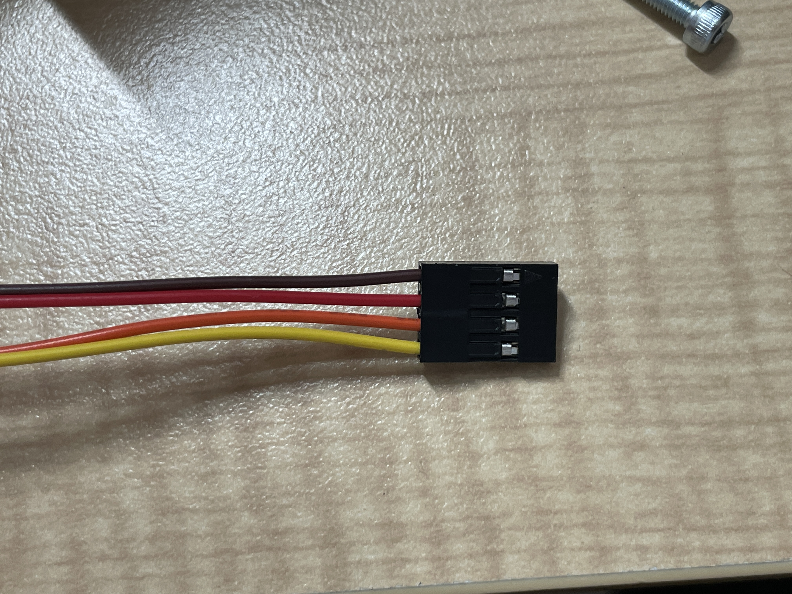

# フォトリフレクタについて
フォトリフレクタはLBR-127HLDである。
- [販売ページ](https://akizukidenshi.com/catalog/g/gP-04500/)
- [データシート](https://akizukidenshi.com/download/lbr127hld.pdf)

配線は
- 茶:GND(LED)
- 赤:VCC(LED)
- オレンジ：コレクタ
- 黄：エミッタ
