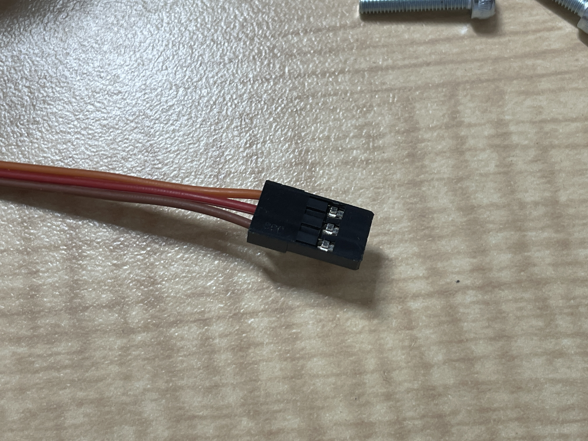

# サーボについて
使用しているサーボはFS90Rというものであり，連続回転可能なものである。
- [販売ページ](https://akizukidenshi.com/catalog/g/gM-13206/)
- [データシート](https://akizukidenshi.com/download/ds/feetech/fs90r_20201214.pdf)

周期20msで0.7ms~2.3msの間でパルス幅を調整する。1.5msが静止点で静止しない場合は，本体下部についている可変抵抗で調整する。

配線は
- オレンジ：信号
- 赤：VCC
- 茶：GND
