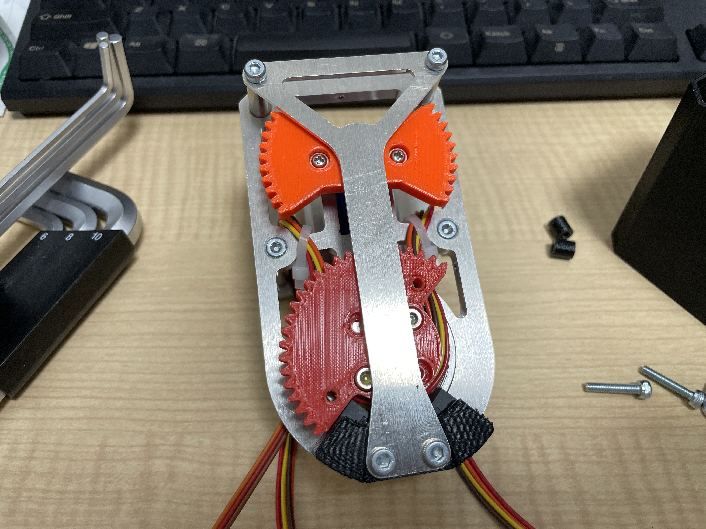

# home>分解方法・構造
## 分解方法
1. 黒色のカバーについているM2キャップねじを７本外す

1. カバーを取ると画像のようになる。オレンジのノブの近くにあるM3キャップねじ二本を外す。スペーサーをなくさないように注意する。

1. 上部と下部についている４本のM3キャップねじを外し，アルミ板も外す。

1. オレンジのギアを外す時は真ん中のタッピングねじを外す。赤色のギアを外す時は，２本のM3キャップねじを外す。穴が４つある理由は右回しのサムターンと左回しのサムターン両方に対応するため。サーボのテストをする際は，破壊防止のためにオレンジの歯車を外したほうが良い。

1. 組み立ては分解の逆。スペーサー等をなくさないようにする
2. サムターンの回転方向が逆だった場合はノブと赤色歯車についている別のねじ穴を使って組み立てする。

## その他
- サーボを交換する際は裏面の四角穴を使ってM2キャップねじを外して交換する。

- 長穴の間隔は30mm